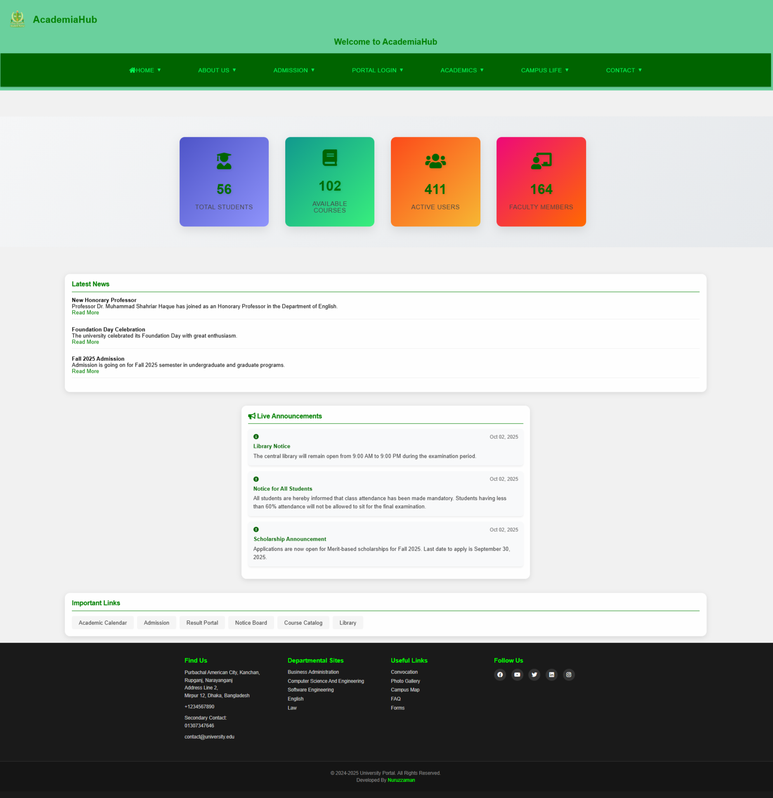

# AcademiaHub - University Portal Management System

AcademiaHub is a state-of-the-art university portal management system developed by Nuruzzaman. This comprehensive platform revolutionizes the way academic institutions manage their operations by providing an integrated solution for students, teachers, and administrators. Built with modern web technologies, it offers a robust set of features for academic management, user authentication, course handling, attendance tracking, and result management.

## 🎯 System Overview

AcademiaHub transforms traditional academic management into a streamlined digital experience with:
- Multi-role user management (Admin, Teacher, Student)
- Secure authentication and authorization
- Comprehensive course management
- Real-time attendance tracking
- Detailed result management
- Interactive user interfaces
- Responsive design for all devices

## 🌟 Key Features

### 🎓 Student Portal
- Secure login and registration system
- Course registration and management
- Real-time attendance tracking
- Academic result access
- Personal profile management
- Class routine viewing
- Course request system
- Fee structure access
- Faculty directory
- Interactive dashboard

### 👨‍🏫 Teacher Portal
- Dedicated login system
- Course management interface
- Attendance recording and management
- Result entry and modification
- Class schedule viewing
- Student performance tracking
- Profile customization
- Course material management
- Student data access
- Automated reporting

### 👑 Admin Portal
- Centralized dashboard
- User management system
- Course approval workflow
- Student verification system
- Result management
- Attendance monitoring
- System-wide announcements
- Database management
- Security controls
- Analytics and reporting

### 🛠️ Technical Features
- Secure session management
- Password reset functionality
- SQL injection protection
- XSS attack prevention
- Responsive design
- Clean user interface
- Error handling
- Data validation
- Automated backups
- Performance optimization

## 🚀 Installation & Setup Guide

### System Requirements
- PHP 7.4 or higher
- MySQL 5.7 or higher
- Apache Web Server
- XAMPP/WAMP/MAMP (recommended)
- Modern web browser
- 512MB minimum RAM
- 100MB disk space

### Detailed Installation Steps

1. Clone the repository:
```bash
git clone https://github.com/Nuruzzaman-Nuru/AcademiaHub.git
```

2. Move the project to your web server directory:
- For XAMPP: `xampp/htdocs/`
- For WAMP: `wamp/www/`
- For MAMP: `mamp/htdocs/`

3. Import the database:
- Open phpMyAdmin
- Create a new database named 'portal'
- Import the SQL file from `sql/portal.sql`

4. Configure the database connection:
- Open `conn.php`
- Update the database credentials if needed

5. Access the portal:
```
http://localhost/AcademiaHub
```

## 📂 Project Structure

```
AcademiaHub/
├── css/                           # Stylesheets and design assets
│   ├── style.css                 # Main stylesheet
│   ├── welcome.css              # Welcome page styles
│   ├── footer.css              # Footer styles
│   └── footer-fix.css         # Footer fixes
├── includes/                    # PHP includes and components
│   └── portal_data.php        # Portal configuration
├── logo/                      # Brand assets and images
│   ├── logo.png             # Main logo
│   └── Gub.jpg             # University logo
├── sql/                    # Database files
│   └── portal.sql        # Main database structure
├── Core Files            # Main functionality
│   ├── index.php       # Landing page
│   ├── admin_*.php    # Admin functionality
│   ├── teacher_*.php # Teacher functionality
│   └── student_*.php # Student functionality
├── Authentication    # User authentication
│   ├── admin_log.php
│   ├── teacher_log.php
│   └── student_log.php
├── Academic          # Academic features
│   ├── departments.php
│   ├── class_routine.php
│   └── academic_calendar.php
├── Management       # System management
│   ├── add_course.php
│   ├── attendence.php
│   └── result.php
└── README.md       # Project documentation
```

## 🔐 Login Information

### Admin Login
- URL: `/admin_log.php`
- Default credentials in database

### Faculty Login
- URL: `/teacher_log.php`
- Credentials provided by admin

### Student Login
- URL: `/student_log.php`
- Registration available via signup

## 🛠️ Technology Stack

### Frontend Technologies
- HTML5 for structure
- CSS3 for styling
- JavaScript for interactivity
- Font Awesome for icons
- Custom CSS animations
- Responsive design principles

### Backend Technologies
- PHP 7.4+ for server-side logic
- MySQL for database management
- Apache web server
- Session management
- Security implementations

### Development Tools
- XAMPP/WAMP/MAMP
- VS Code (recommended IDE)
- Git for version control
- phpMyAdmin for database management
- Chrome DevTools for testing

### Additional Features
- Cross-browser compatibility
- Mobile-first approach
- Progressive enhancement
- Performance optimization
- Security best practices

## 📱 Responsive Design

The portal is fully responsive and optimized for:
- Desktop computers
- Tablets
- Mobile devices

## 🔄 Key Pages

- `index.php` - Homepage with news and announcements
- `faculty.php` - Faculty member profiles
- `departments.php` - Academic departments
- `academic_calendar.php` - Academic schedule
- `class_routine.php` - Class schedules
- And many more...

## 🤝 Contributing

1. Fork the repository
2. Create your feature branch (`git checkout -b feature/AmazingFeature`)
3. Commit your changes (`git commit -m 'Add some AmazingFeature'`)
4. Push to the branch (`git push origin feature/AmazingFeature`)
5. Open a Pull Request

## 📝 License

This project is licensed under standard copyright laws. All rights reserved.

## ✨ Credits

Developed by: Nuruzzaman
Student ID: 221902335

## � Security Implementation

- Secure session management
- Password hashing and salting
- SQL injection prevention
- XSS attack protection
- CSRF token implementation
- Input validation and sanitization
- Error handling and logging
- Regular security updates

## 🌐 Browser Support

- Google Chrome (recommended)
- Mozilla Firefox
- Microsoft Edge
- Safari
- Opera

## 📞 Contact & Support

### Developer Information
- **Developer:** Nuruzzaman
- **Student ID:** 221902335
- **GitHub:** [@Nuruzzaman-Nuru](https://github.com/Nuruzzaman-Nuru)
- **Portfolio:** [Your Portfolio URL]
- **Email:** [Your Email]

### Support
- For technical issues: Open an issue on GitHub
- For security concerns: Contact directly via email
- For feature requests: Use GitHub discussions
- For contributions: Submit a pull request

### Documentation
- Inline code documentation
- API documentation available
- Setup guides included
- User manuals provided

---

Last Updated: October 2, 2025
Version: 1.0.0
License: All Rights Reserved © 2025
